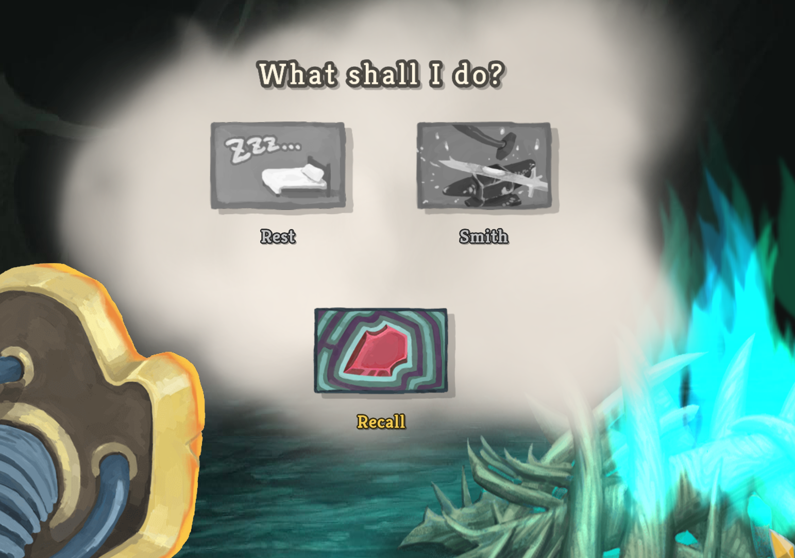
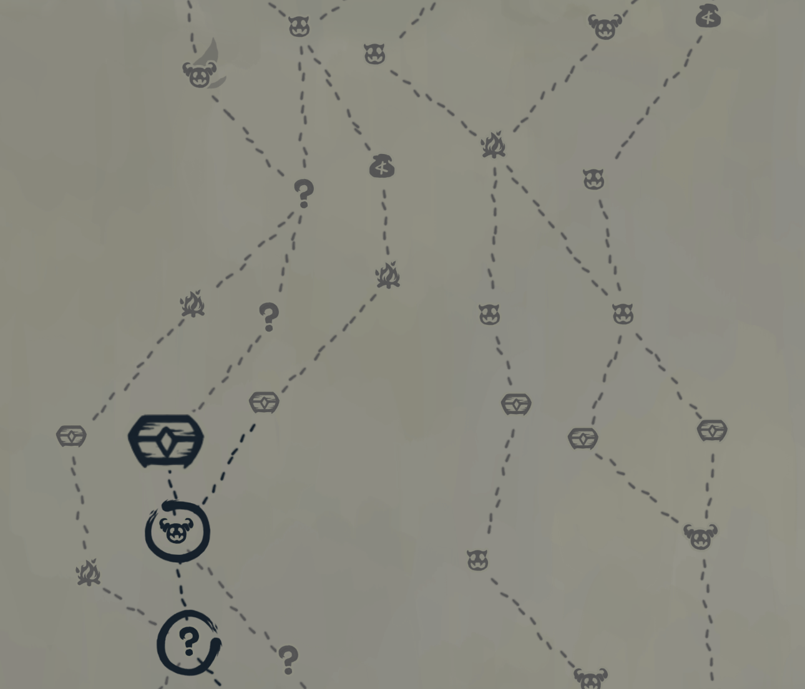
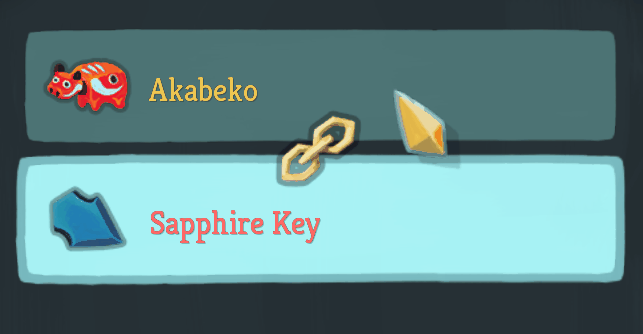

# Force Key

Forces you to take keys in act 3.

### How it Works

At the last rest site, if you have not recalled, options other than recall will be disabled. 

You will be blocked from pathing that will deny you access to the empowered elite.

You cannot claim the relic in the last chest if you don't have the sapphire key.

### Special Cases

There are some situations when the mod may not function properly. 

#### Spire with Friends

In the coop mode of [Spire with Friends](https://steamcommunity.com/sharedfiles/filedetails/?id=2395241968), your teammates can give you keys. There are more emerald key nodes on the map, but you don't always get emerald keys from them (an "empowered chest" cannot give you the emerald key). This mod has not been tested with Spire with Friends, and may crash the game or force you into a path when you don't have to take it. You should disable this mod when playing Spire with Friends.

#### Wing Boots

The relic **Wing Boots** lets you ignore paths while traveling between rooms for up to 3 times. The mod has tried to accommodate the relic, and it should work well in most cases. However, there is a good chance that there will be bugs related to this relic. If you found the mod blocking your path when it's not supposed to, please **take a screenshot of your map** and report it as a bug.

#### Flight

The **Flight** modifier in custom runs lets you ignore paths while traveling between rooms the whole run. Its functionally identical to wing boots, though there may still be some bugs associated with it. If you find yourself being blocked from a path that you are supposed to travel through, please disable the mod.

